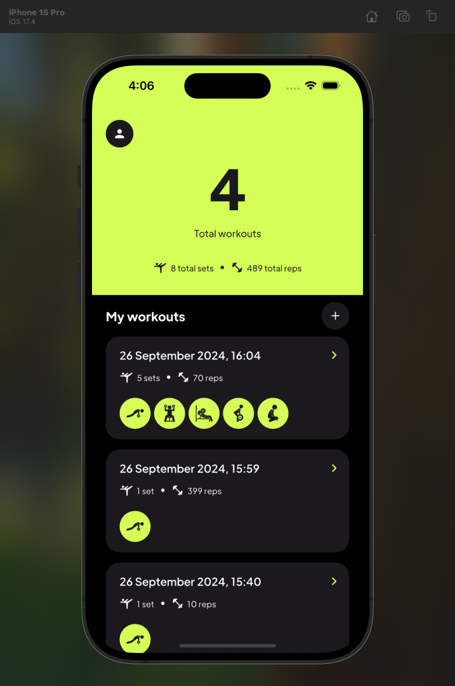
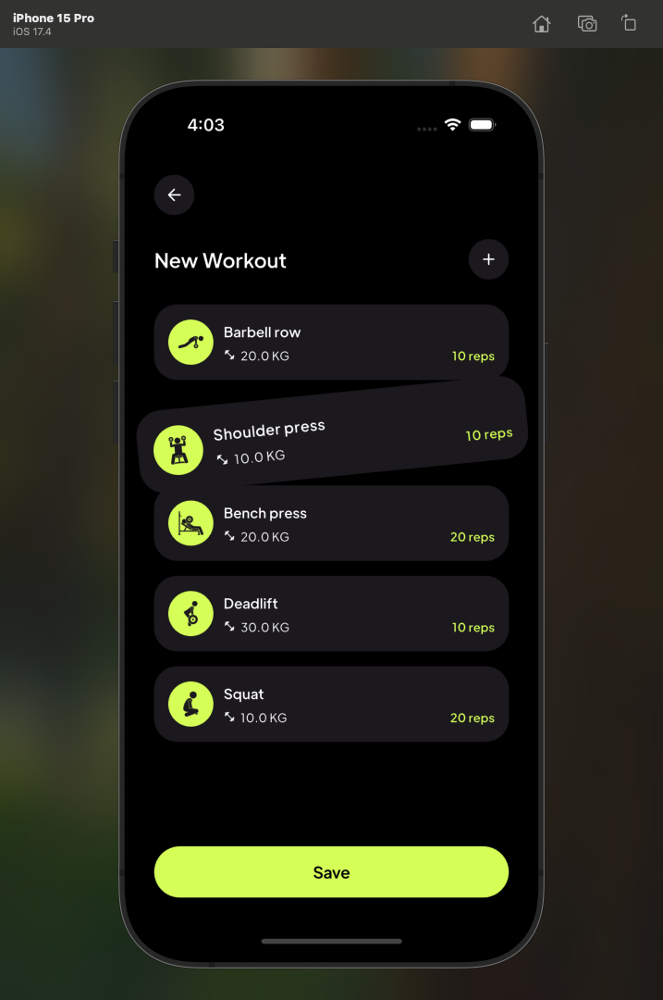

# Workout Tracker Application

## Project Overview

This project is a workout tracking application built with Flutter. It allows users to manage their workout routines, track progress, and perform CRUD operations on recorded workouts. The app includes user authentication, exercise recording, and a modular, maintainable structure that adheres to clean architecture and SOLID principles.

## Screenshots

| Screenshot 1 | Screenshot 2 |
|--------------|--------------|
|  |  |


## Architecture

The application is designed following Clean Architecture and Test-Driven Development (TDD) principles. It is structured into four main layers:

1. **Data Layer (models):** Defines data models and handles data parsing.
2. **Domain Layer (services & repositories):** Contains business logic and service interfaces. Repositories handle data fetching and persistence, communicating with services like Firebase.
3. **Presentation Layer (providers & UI):** Manages state using Riverpod and contains UI components. The UI layer communicates with the provider layer to fetch and display data.
4. **Core Layer (framework):** Contains shared utilities such as theme configuration and navigation.

### Project Structure

```plaintext
app/
│
├── modules/
│   ├── authentication/
│   │   ├── data/
│   │   │   └── models/
│   │   │       └── user_model.dart           # Data model for user information
│   │   ├── domain/
│   │   │   ├── repositories/
│   │   │   │   ├── interfaces/
│   │   │   │   │   └── authentication_repository_interface.dart   # Interface for the repository
│   │   │   │   └── authentication_repository.dart                 # Implementation of the repository interface
│   │   │   ├── services/
│   │   │   │   ├── interfaces/
│   │   │   │   │   └── authentication_service_interface.dart      # Interface for the service
│   │   │   │   └── authentication_service.dart                    # Implementation of the service interface
│   │   ├── presentation/
│   │   │   ├── pages/
│   │   │   │   ├── forgot_password_page.dart                      # UI for forgot password
│   │   │   │   ├── login_page.dart                                # UI for login
│   │   │   │   └── register_page.dart                             # UI for registration
│   │   │   ├── providers/
│   │   │   │   ├── forgot_password/                               # State management for forgot password
│   │   │   │   ├── login/                                         # State management for login
│   │   │   │   └── register/                                      # State management for registration
│   ├── dashboard/                                                 # Dashboard of the application
│   ├── profile/                                                   # User profile related components
│   └── workout/                                                   # Workout related components
│
├── core/
│   ├── framework/theme/                                           # Theme and styling configurations
│   ├── navigation/                                                # Navigation configuration
│   └── shared/                                                    # Shared utilities and constants
│
└── main.dart                                                      # Entry point of the application
```

## Packages Used

- **[flutter_riverpod](https://pub.dev/packages/flutter_riverpod):** Used for state management, providing a reactive programming model.
- **[shared_preferences](https://pub.dev/packages/shared_preferences):** For local storage of small key-value pairs, such as user login state.
- **[firebase_core](https://pub.dev/packages/firebase_core), [firebase_auth](https://pub.dev/packages/firebase_auth), [cloud_firestore](https://pub.dev/packages/cloud_firestore):** Firebase services for authentication and database storage.
- **[freezed_annotation](https://pub.dev/packages/freezed_annotation):** For generating immutable data classes, supporting SOLID principles by providing easy data manipulation and state management.
- **[equatable](https://pub.dev/packages/equatable):** Simplifies value comparison for data classes.
- **[mocktail](https://pub.dev/packages/mocktail):** Used for mocking in unit and integration testing.
- **[dartz](https://pub.dev/packages/dartz):** Provides functional programming constructs, used to handle errors and data manipulation gracefully.

## Testing

The project includes a comprehensive suite of tests covering:

- **Unit Tests:** For repositories and providers.
- **Widget Tests:** For individual UI components.
- **Integration Tests:** An end-to-end test simulating a user journey through the app.

## State Management

Riverpod is used for state management, providing a clear separation of UI and business logic. Providers are defined for handling authentication, workout records, and other application states, ensuring a reactive and maintainable codebase.

## Authentication

The app supports user authentication using Firebase Authentication. Users can register, log in, and reset their passwords. User data is stored in Firestore, and local user state is persisted using shared preferences.